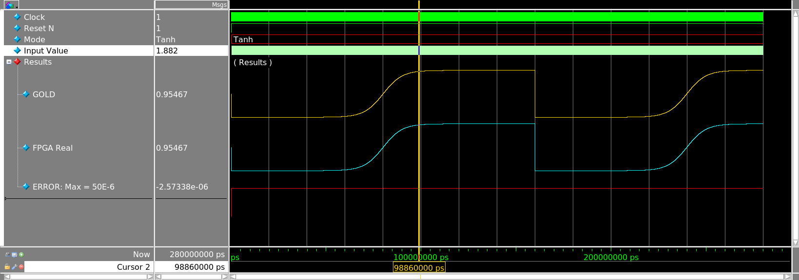

# Tanh-x-Verilog

- Author :     RUIZ QUINTANA, Diego
- Description: This module performs the hyperbolic 
  tangent for AI purposes. It has a latency of 11
  clock cycles and a Slow Fmax of 160 MHz and a 
  fast fmax of 315 MHz. The number of ALM's are 210
  and a total of 289 registers. The input is in 
  IEEE-754 standard, the intermediate calculus are
  performed in S13.18 Q format in fixed point and 
  output is in the IEEE-754 standard of 32 bits.

The used method to calculate the Tanh(x) is via
table interpolation doing use of 2 ROMS of 1024
addresses, one of them with a length word of 19
bits and the other with only 12 bits of length word.

The tricky here is resolve the address of table 
interpolator ROM with the SMB's of the IEEE-754 input 
mantissa, avoiding in this way the hardware necessary 
to swap between IEEE-754 and fixed point, but 
the values in ROM are stored in Fixed Point.

One of the advantages of this arch. is the possibility 
of adding new math functions, using the same interpolator
and address resolver. In this way can be implemented 
the sigmoid function or the exp function, at the expense of
only a little more logic (multipliers and adders).

One particularity of the Tanh(x) function is the 3 regions in it:
Saturation, Hyperbolic and lineal. Taking in count this, the input values
greaters or equals than 8 are in the saturation region, it is to say that
the output from the function will be 1. Values in range from 0 to
1/32 are in the lineal region, therefore Tanh(x) = x and finally is
the hyperbolic region defined between 1/32 <= x < 8 --> This module
implement the calculus in the hyperbolic region. Because of the Tanh(x) 
function is a odd function, then: Tanh(-x) = -Tanh(x), so the regions
mentioned are aplicables in the negative range of input values.

The linear and saturation region they don't need be calculated via interpolation,
in this way the hardware resources are also relaxed. Modules "regions"
and "linear_out" implement the saturation and linear regions of Tanh(x).

# ModelSim simulation
The simulation of the Tanh(x) in the hyperbolic region is swhows in the following image:

